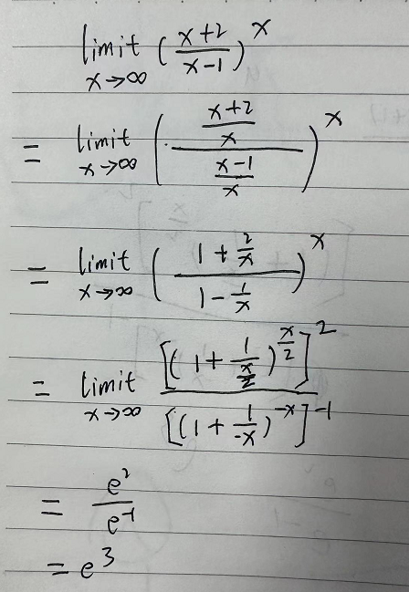

# 集合

+ a属于集合A表示为：a∈A
+ a属于集合A表示为：a∉A
+ 集合表示方法
  + 列举法：{1,2,3,4,5}
  + 描述法：{a|a的特征}
+ 集合A包含于集合B表示为：A⊂B
+ 如果A⊂B且B⊂A，则A=B
+ 并集：两个集合得总和；表示为A∪B
+ 交集：两个集合共有部分；表示为A∩B
+ 全集：所有研究对象；表示为Ω（读作欧米伽）
+ 补集：全集中去掉集合A的部分称为集合A的补集；表示为Ā
+ 运算：
  + A∩(B∪C) = (A∩B)∪(A∩C)
  + A∪(B∩C) = (A∪B)∩(A∪C)
  + A∪B的补集 = A的补集 ∩ B的补集
  + A∩B的补集 = A的补集 ∪ B的补集
+ 邻域：`a-δ ~ a+δ`称为a的邻域，如果不包含中心的a，则称为去心邻域

# 函数

+ 周期函数

  + 如果f(x+T) = f(x)，则f(x)为周期函数

  + 如果f(x)的周期为T，则f(ax+b)的周期为T/a

    系数a不会扩大纵坐标的值，只会拉伸或压缩横坐标

# 极限

## 运算法则

> 前提：
>
> + 极限内函数为有限个
> + 每个函数的极限是存在的

+ 若`limit f(x) = a`，`limit g(x) = b`，则
  + `limit (f(x) + g(x))` = `limit f(x) + limit g(x)` = a + b
  + `limit (f(x) - g(x))` = `limit f(x) - limit g(x)` = a - b
  + `limit (f(x) * g(x))` = `limit f(x) * limit g(x)` = a * b
  + `limit (f(x) / g(x))` = `limit f(x) / limit g(x)` = a / b
+ `limit C * f(x)` = `C * limit f(x)`
+ `limit f(x)^n` = `(limit f(x))^n`
+ `limit ln f(x) = ln limit f(x)`
+ `limit e^f(x) = e^(limit f(x)) `

## 求极限技巧

+ x趋近于∞时

  + 分子分母同次，极限为最高次系数之比

     

    x趋近于∞时，划掉的项都等于0

  + 分母次数高，极限为0

     

  + 分子次数高，极限为∞

     

+ 多项式求极限时，目标是将分子或者分母简化为常数或者趋近于0的项，常用方法如：

  + 同时除以最高次项（参见上面）

+ 如果x极限值代入后分子分母同时为0，则需要重新约分，让其中一项不为0

   

+ 分母趋于0时，如果极限为常数，则表名分子必然为0

  > 如果分子不为0，极限必然为∞

   

## 极限存在法则

+ 夹逼定理

  + 定义

    函数f(x),g(x),h(x)，均满足在x0的去心邻域内，g(x)≤f(x)≤h(x)，并且x趋近于x0时，g(x)和h(x)均趋近于a，则f(x)也趋近于a

  + 例题

    + 求n->∞时，(2^n)/n! 的极限

    + 解

       

      这里需要保留1个n项，来保留趋势

+ 单调有界的数列必有极限

## 重要极限

> 碰到长得像的，要凑成下面形式

+ x->0时，sinx/x的极限 = 1

   

+ x->0时，tanx/x的极限 = 1

+ x->∞时，(1+1/n)^n的极限等于e

   

## 无穷小的比较

+ 无穷小的比较是指，比较谁趋近于0的速度更快

### 如何比较

前提：f(x)和g(x)极限都等于0，且g(x)!=0

此时计算`f(x)/g(x)`的极限

| limit f(x)/g(x) | 表示                 | 称作                   | 记作         |
| :-------------: | -------------------- | ---------------------- | ------------ |
|        0        | f(x)比g(x)更快       | f(x)是g(x)的高阶无穷小 | f(x)=o(g(x)) |
|        ∞        | g(x)比f(x)更快       | f(x)是g(x)的低阶无穷小 |              |
|   C常数(C≠0)    | 速度取决于C是否大于1 | f(x)是g(x)的同阶无穷小 |              |
|        1        | 速度相同             | f(x)是g(x)的等阶无穷小 | f(x)~g(x)    |

### 重要结论

+ `x -> 0`，`ln(1+x)` ~ `x`
+ `x -> 0`，`a^x - 1` ~ `x * ln a`，当`a=e`时，`e^x-1` ~ `x`
+ `x -> 0`，`(1+x)^(1/n) - 1` ~ `x/n`
+ `x -> 0`，`sinx ~ x`
+ `x -> 0`，`tanx ~ x`
+ `x -> 0`，`1/(1+x) ~ 1-x`

### 定理

+ 若：`f₁(x) ~ f₂(x)`，`g₁(x) ~ g₂(x)`，且`limit (f₂(x)/g₂(x))`存在

  则：`limit (f₁(x)/g₁(x))` = `limit (f₂(x)/g₂(x))`

+ 利用这个定理可以在求极限过程中直接进行替换

  只有在整个极限表达式中，函数不与任何其他部分相加减时，才可以替换

+ 例

   

# 导数

## 定义

+ 导数可以用以下几种形式表示

  + f'(x)
  +  
  +  
  +  

+ 定义

   

## 常用导函数

| 原函数                                                       | 导函数                                                       |
| ------------------------------------------------------------ | ------------------------------------------------------------ |
| f(x) = x²                                                    | f'(x) = 2x                                                   |
| f(x) = C                                                     | f'(x) = 0                                                    |
| f(x) = xⁿ                                                    | f'(x) = n*x^(n-1)                                            |
| f(x) = sinx                                                  | f'(x) = cosx                                                 |
| f(x) = cosx                                                  | f'(x) = -sinx                                                |
| f(x) =  | f'(x) = 1/n *  |
| f(x) = ln x                                                  | f'(x) = 1/x                                                  |
| f(x) = a^x                                                   | f'(x) = a^x * ln a                                           |
| f(x) = e^x                                                   | f'(x) = e^x                                                  |

## 求导法则

+ (u + v)' = u' + v'

+ (u * v)' = u' * v + u * v'

+ (C * u)' = C * u'

+ (u/v)' = (u' * v - u * v')/v²

+ 反函数的导数是原函数导数的倒数

  y=f(x)，x=g(y)，则g'(y) = 1/f'(x)

+ y=f(u)，u=g(x)，则

   

  + 例

     

+ y=f(u)，x=g(u)，则

   

## 高阶导数

+ 高阶导数就是对一个函数求多次导（求导函数的导函数），记作：

  + f''(x) 

    最多表示3阶

  + f⁽ⁿ⁾(x)

  +  

+ 常用高阶导数

  | 原函数 | 导函数               |
  | ------ | -------------------- |
  | y=sinx | y⁽ⁿ⁾ = sin(x + nπ/2) |
  | y=cosx | y⁽ⁿ⁾ = cos(x + nπ/2) |

# 微分

## 定义

+ Δy = A * Δx + o(Δx)，因为o(Δx)很小，可以忽略

  所以可以记作：dy = A * Δx

  Δy 是精确值，dy是近似值

+ 可导必可微，可微必可导

+ 其中的A就是f'(x)，Δx可以用dx表示

  dy = f'(x) * dx

   

## 运算法则

+ d(u±v) = du ± dv
+ d(uv) = vdu + udv
+ d(Cu) = C * du
+ d(u / v) = (vdu - udv) / v²

## 近似计算

+ 当x->0时，如果以下方程式与其他部分不是加减的关系，可以近似替换
  +  
  + sinx ≈ x
  + tanx ≈ x
  + e^x ≈ 1 + x
  + ln(1+x) ≈ x
  + 1/(1+x) ≈ 1-x
  + arcsin x ≈ x
+ 例
  + ln1.03 = ln(1+0.03) ，根据`ln(1+x) ≈ x`，结果直接可以等于0.03

## 微分中值定理

微分中值定理是一系列定理的总称

### 费马引理

+ 函数f(x)在点x0的某邻域U(x0)内有定义，并且在x0处可导，如果对任意的x∈U(x0)，有f(x)≤f(x0)(或f(x)≥f(xo))，那么f’(x0)=0。x0称为**驻点**

+ 通俗理解就是，x0是极值点，并且该点可导，则x0导数为0

   

+ 驻点

  + 导数为0的点

  + 驻点未必是极值点

     

### 罗尔定理

+ f(x)满足：在[a,b]连续，在(a,b)可导，f(a)=f(b)，则至少存在1个ξ∈(a,b)，使得f'(ξ)=0

   

### 拉格朗日中值定理

+ f(x)满足：在[a,b]连续，在(a,b)可导，则至少存在1个ξ∈(a,b)，使得f(b)-f(a)=f'(ξ)(b-a)

+ 理解

  f(b)-f(a)=f'(ξ)(b-a)换一种表达形式就是：f'(ξ)=(f(b)-f(a))/(b-a)

  换句话就是：(a,b)中总能找到1点使得该点导数等于a到b点的斜率

   

+ 罗尔定理是拉格朗日中值定理中f(a)=f(b)的特殊情况

### 柯西中值定理

+ f(x)，g(x)满足：在[a,b]连续，在(a,b)可导，任意x∈(a,b)，g'(x)≠0，则至少存在1个ξ使得

  (f(b)-f(a))/(g(b)-g(a))=f'(ξ)/g'(ξ)

+ 理解

   

  | t    | g(t) | f(t) |
  | ---- | ---- | ---- |
  | -1   | 9    | 1    |
  | 0    | 4    | 0    |
  | 1    | 1    | 1    |
  | 2    | 0    | 4    |
  | 3    | 1    | 9    |

  使用上表中g(t)与f(t)对应的值绘制图像，能够保证g(t)与f(t)对应时，是相同的t

   

  在连接[g(a),f(a)]和[g(b),f(b)]的曲线上，至少存在1个点[g(ξ),f(ξ)]的切线斜率等于这两点连线的斜率`(f(b)-f(a))/(g(b)-g(a))`

  图中曲线的切线斜率：

   

  所以点[g(ξ),f(ξ)]的切线斜率：f'(ξ)/g'(ξ)

  综上可证，柯西中值定理成立

+ 拉个朗日定理是柯西定理在`g(x)=x`时的特殊情况

### 泰勒定理

> 好像不重要，先不管了

## 洛必达法则

+ 法则

  若f(x),g(x)满足

  + x->x0时，`f(x) ->0，g(x) ->0`或`f(x) ->∞，g(x) ->∞`
  + 均在x0邻域内（可去心）可导，g'(x) ≠ 0
  + x->x0时，f'(x)/g'(x) = a（或∞）

  则：x->x0时，f(x)/g(x) = f'(x)/g'(x) = a（或∞）

+ 例

   

+ 当遇到以下形式时，可以转换成`0/0`或者`∞/∞`形式后使用洛必达法则

  + `0 * ∞`型

    +  

    + 例

       

  + 指数型

    + 如：`0^0`型、`1^∞`型、`∞^0`型

    + 利用等式： 

    + 例

       

    
  
    
  
    

# 公式

## 三角函数

> [参见](https://zhuanlan.zhihu.com/p/390928056) 

+ sin²(x) + cos²(x) = 1

### 诱导公式

对于形如`T(kπ/2 ± α)`（其中T代表三角函数）

+ 在图像上，可以理解为

  + kπ/2：表示图像整体左移多少
  + α：如果符号为-，表示沿y轴翻转
  + 顺序为：先移动再翻转
  + 如果α有系数，系数大于1，则周期变长

+ 奇变偶不变，符号看象限

  + 奇变偶不变：k为偶数时，函数不变，k为基数时，函数变为余函数（sin->cos,cos->sin,tan->cot,cot->tan）
  + 符号看象限：没理解

+ 用图像更好理解，口诀别管了

+ 例

   

### 二角和差公式

+ 正弦赛壳壳赛符号同

  + sin(α+β) = sinα * cosβ + cosα * sinβ

  + sin(α-β) = sinα * cosβ - cosα * sinβ

+ 余弦壳壳赛赛符号异

  + cos(α+β) = cosα * cosβ  - sinα * sinβ
  + cos(α-β) = cosα * cosβ  + sinα * sinβ

### 积化和差、和差化积

 

### 倍角公式

+ 倍角公式可以用二角和差公式推导出，这里只记录二倍角公式

+ 升幂缩角

   

+ 降幂扩角

  把上面公式反过来即可得到

   

## 指数公式

+ 幂的分配律：(a * b)^n = a^n * b^n

## 极限

### 运算法则

+ 若`limit f(x) = a`，`limit g(x) = b`，则
  + `limit (f(x) + g(x))` = `limit f(x) + limit g(x)` = a + b
  + `limit (f(x) - g(x))` = `limit f(x) - limit g(x)` = a - b
  + `limit (f(x) * g(x))` = `limit f(x) * limit g(x)` = a * b
  + `limit (f(x) / g(x))` = `limit f(x) / limit g(x)` = a / b
+ `limit C * f(x)` = `C * limit f(x)`
+ `limit f(x)^n` = `(limit f(x))^n`
+ `limit ln f(x) = ln limit f(x)`
+ `limit e^f(x) = e^(limit f(x)) `

### 重要极限

+ x->0时，sinx/x的极限 = 1
+ x->∞时，(1+1/n)^n的极限等于e

### 等价替换

当x->0时，如果以下方程式与其他部分不是加减的关系，可以近似替换

+ `x -> 0`，`ln(1+x)` ~ `x`

+ `x -> 0`，`a^x - 1` ~ `x * ln a`

  当`a=e`时，`e^x-1` ~ `x`

+ `x -> 0`，`(1+x)^(1/n) - 1` ~ `x/n`

+ `x -> 0`，`sinx ~ x`

+ `x -> 0`，`tanx ~ x`

+ `x -> 0`，`1/(1+x) ~ 1-x`

## 导数

### 常用导函数

| 原函数                                                       | 导函数                                                       |
| ------------------------------------------------------------ | ------------------------------------------------------------ |
| f(x) = x²                                                    | f'(x) = 2x                                                   |
| f(x) = C                                                     | f'(x) = 0                                                    |
| f(x) = xⁿ                                                    | f'(x) = n*x^(n-1)                                            |
| f(x) = sinx                                                  | f'(x) = cosx                                                 |
| f(x) = cosx                                                  | f'(x) = -sinx                                                |
| f(x) =  | f'(x) = 1/n *  |
| f(x) = ln x                                                  | f'(x) = 1/x                                                  |
| f(x) = a^x                                                   | f'(x) = a^x * ln a                                           |
| f(x) = e^x                                                   | f'(x) = e^x                                                  |

### 求导法则

+ (u + v)' = u' + v'

+ (u * v)' = u' * v + u * v'

+ (C * u)' = C * u'

+ (u/v)' = (u' * v - u * v')/v²

+ 反函数的导数是原函数导数的倒数

  y=f(x)，x=g(y)，则g'(y) = 1/f'(x)

+ y=f(u)，u=g(x)，则

   

  + 例

     

+ y=f(u)，x=g(u)，则

   

